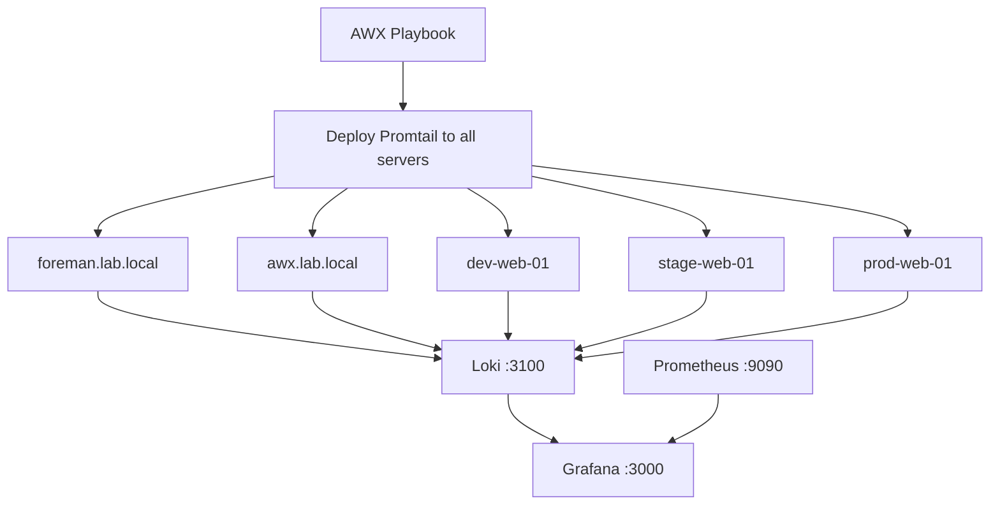
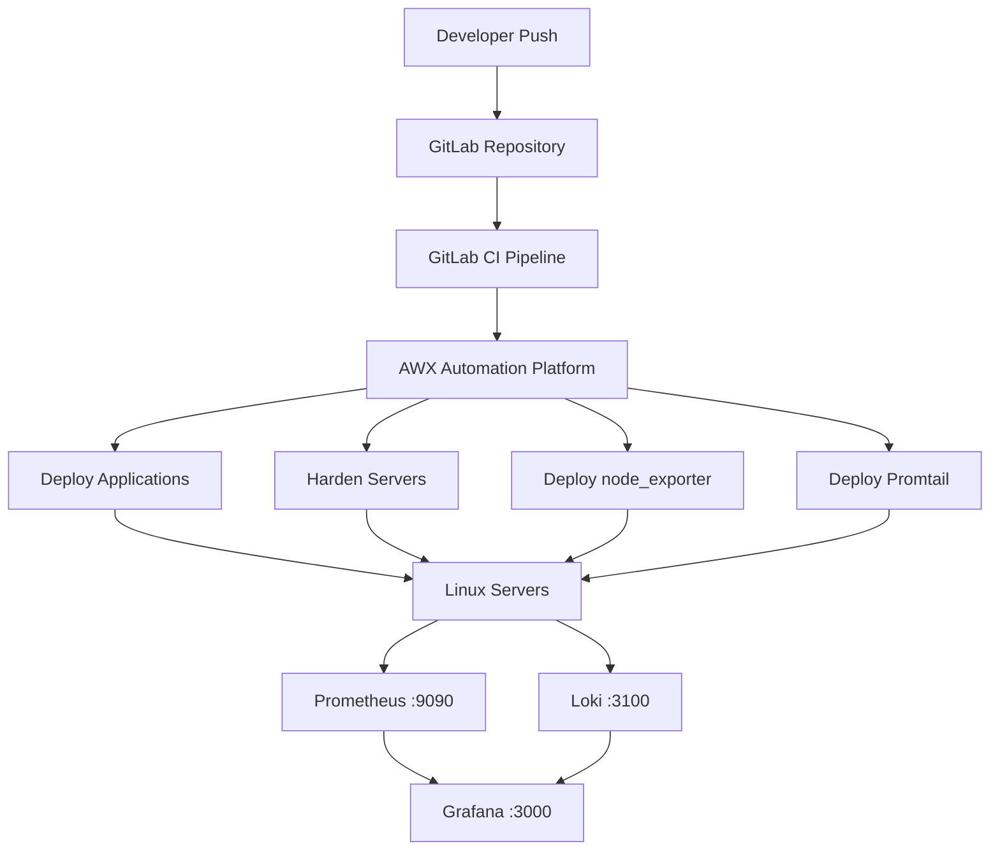
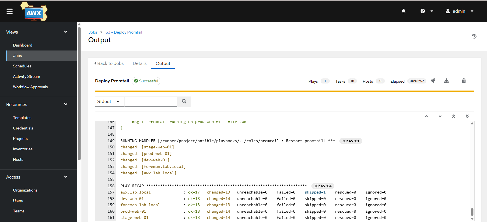
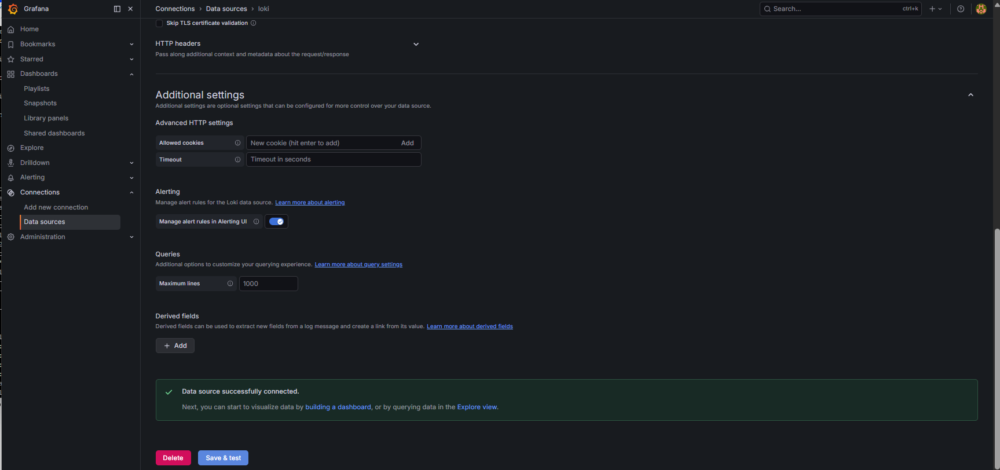
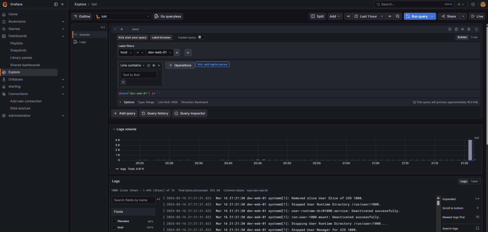
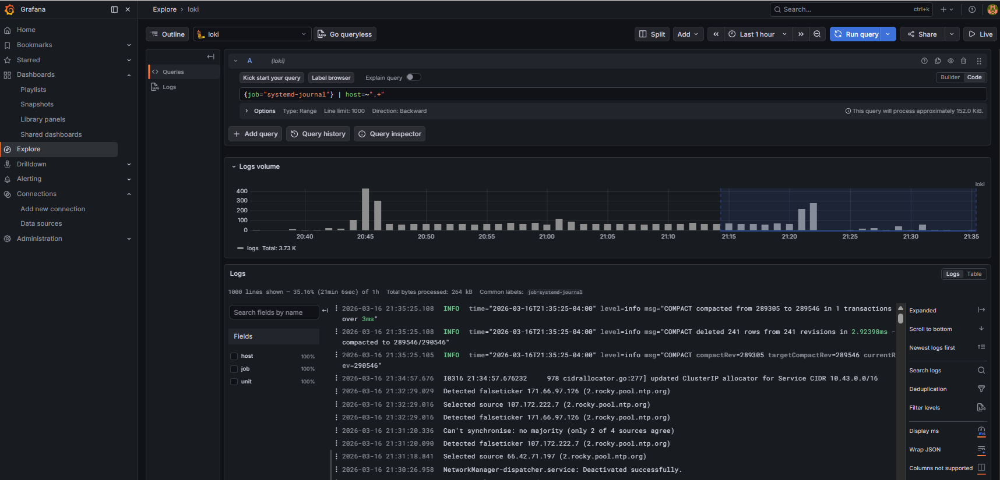

# Centralized Log Management

Centralized log aggregation stack using Grafana Loki and Promtail deployed
across a six-server Rocky Linux lab environment. Promtail agents ship logs
from all servers to Loki. Grafana provides unified log querying and
visualization alongside existing Prometheus metrics from Project 3.

---

## Architecture


---

## Full Platform Architecture

This project completes the observability layer. The diagram below shows
how the entire platform connects from developer push through to unified
metrics and log visualization in Grafana.


---

## Technologies

| Technology    | Purpose                              |
| ------------- | ------------------------------------ |
| Grafana Loki  | Log aggregation and storage          |
| Promtail      | Log shipping agent                   |
| Grafana       | Log and metrics visualization        |
| Ansible       | Automated Promtail deployment        |
| AWX           | Ansible Automation Platform          |
| Rocky Linux 9 | All servers                          |

---

## Environment

| Host                  | Role                        | IP              |
| --------------------- | --------------------------- | --------------- |
| monitoring.lab.local  | Loki + Grafana              | 192.168.111.40  |
| foreman.lab.local     | Log source                  | 192.168.111.20  |
| awx.lab.local         | Log source                  | 192.168.111.30  |
| dev-web-01            | Log source                  | 192.168.111.101 |
| stage-web-01          | Log source                  | 192.168.111.102 |
| prod-web-01           | Log source                  | 192.168.111.103 |

---

## Log Sources Collected

Each server ships three log streams to Loki:

| Stream | Source | Label |
| ------ | ------ | ----- |
| System messages | /var/log/messages | job=syslog |
| Security events | /var/log/secure | job=secure |
| Systemd journal | journald | job=systemd-journal |

---

## Example Queries
```logql
{host="dev-web-01"}
{job="systemd-journal"} | host=~".+"
{job="syslog"} |= "error"
{job="secure"} |= "sshd"
{job="secure"} |= "sudo" |= "FAILED"
```

---

## Verified Live Data

All 5 servers confirmed shipping logs to Loki:
```
curl -s "http://192.168.111.40:3100/loki/api/v1/label/host/values"
{
    "status": "success",
    "data": ["awx", "dev-web-01", "foreman", "prod-web-01", "stage-web-01"]
}
```

---

## Extends Project 3

This project extends the monitoring stack from Project 3. The same Grafana
instance now provides both metrics and logs in a single interface:

- Metrics: Prometheus -> node_exporter -> CPU, RAM, disk, network
- Logs: Loki -> Promtail -> syslog, secure, systemd journal

---

## Screenshots

### AWX Promtail Deployment


### Loki Data Source Connected


### Live Log Exploration


### Multi-Host Log Query


---

## DevOps Skills Demonstrated

- Centralized log aggregation architecture
- Ansible role development for log shipping agents
- Loki installation and configuration
- LogQL query language for log analysis
- Grafana multi-datasource configuration (Prometheus + Loki)
- AWX-driven multi-server agent deployment
- Systemd journal integration
- Security log collection (/var/log/secure)
- SELinux context troubleshooting (restorecon for new binaries)

---

## Part of DevOps Portfolio

- [Project 1 - Enterprise Infrastructure Automation Lab](https://github.com/proclaudio/enterprise-infrastructure-automation-lab)
- [Project 2 - CI/CD Push-to-Deploy Pipeline](https://github.com/proclaudio/cicd-push-to-deploy-pipeline)
- [Project 3 - Infrastructure Monitoring Stack](https://github.com/proclaudio/infrastructure-monitoring-stack)
- [Project 4 - Automated Security Hardening](https://github.com/proclaudio/automated-security-hardening)
- **Project 5 - Centralized Log Management** (this repo)
- Project 6 - Patch Management + Drift Detection (coming soon)
- Project 7 - AWX RBAC + Team Management (coming soon)
- Project 8 - Kubernetes Platform Lab (coming soon)
